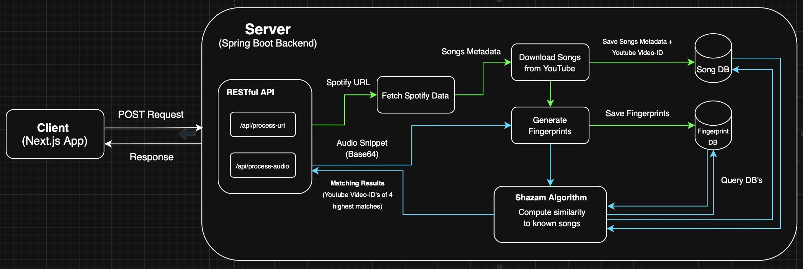

# TrackMatch - A Music Recognition App

This project implements the **Shazam Algorithm** for music recognition. It is a full-stack application combining a powerful backend service for audio fingerprint processing and matching with a modern frontend.

 

    

<a href="https://drive.google.com/file/d/1wfJiKjMyx45iD1AhXBeAKbp2wM6MmKC9/view?usp=share_link" target="_blank">Demo in video</a>

## ✨ Features

* **Song Fingerprinting:** Creation of unique digital audio signatures (fingerprints) from music tracks for fast and efficient identification.
* **Database-Driven Recognition:** Utilization of an efficient matching algorithm to match audio snippets against a database of known song fingerprints.
* **Spotify Integration:** Fetching song metadata using the Spotify Web API.
* **YouTube Integration:** Downloading songs from YouTube using yt-dlp and storing the corresponding Video-IDs for playback.
* **RESTful API:** Two clearly defined endpoints for data processing and the recognition workflow.
* **Live-Updates:** WebSocket enabling real-time updates of server activity.

## 🛠️ Technology Stack

| Component | Technology | Description |
| :--- | :--- | :--- |
| **Frontend** | **Next.js** (React, Tailwind) | Modern, performant user interface. |
| **Backend** | **Spring Boot** (Java) | Robust and scalable RESTful API server. |
| **Database** | **PostgreSQL** | Reliable relational database for song and fingerprint data. |

## 📐 System Architecture

The system consists of a Next.js client application and a Spring Boot Backend server, which controls all data processing and the recognition mechanism.

The image below illustrates the data flow and system components:

The architecture is divided into two main processes, accessible via the REST interface:

## 💻 API Endpoints

The Spring Boot Backend provides two central RESTful endpoints that map the complete song recognition lifecycle:

### 1. Song Data Processing

This endpoint is responsible for initializing the database with new songs.

* **Endpoint:** `POST /api/process-url`
* **Input:** A Spotify URL.
* **Flow:**
    1.  `Fetch Spotify Data`: Retrieves song metadata.
    2.  `Download Songs from YouTube`: Downloads the audio file.
    3.  `Generate Fingerprints`: Creates digital audio fingerprints.
    4.  `Save Song Metadata + Youtube-ID`: Stores metadata in the **Song DB**.
    5.  `Save Fingerprints`: Stores fingerprints in the **Fingerprint DB**.

### 2. Audio Recognition

This endpoint handles the actual recognition process for a recorded audio snippet.

* **Endpoint:** `POST /api/process-audio`
* **Input:** A Base64-encoded audio snippet
* **Flow:**
    1.  `Generate Fingerprints`: Creates the fingerprint of the input snippet.
    2.  `Shazam Algorithm (Compute similarity)`: Applies the matching algorithm against the **Fingerprint DB**.
    3.  **Output:** Returns `Matching Results` (YouTube Video-IDs of 4 highest matches).

## 📚 Resources

Key sources and references used for the implementation of the core features:

* [How does Shazam work - Coding Geek](https://drive.google.com/file/d/1ahyCTXBAZiuni6RTzHzLoOwwfTRFaU-C/view)
* [YouTube video explaining the core concepts](https://www.youtube.com/watch?v=a0CVCcb0RJM&t=307s)

## 📄 License

This project is licensed under the **MIT License**. See the accompanying [License](./LICENSE) file for more details.